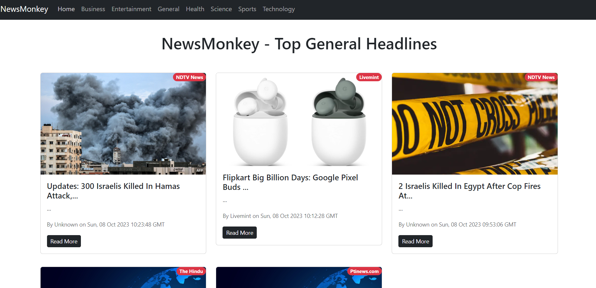
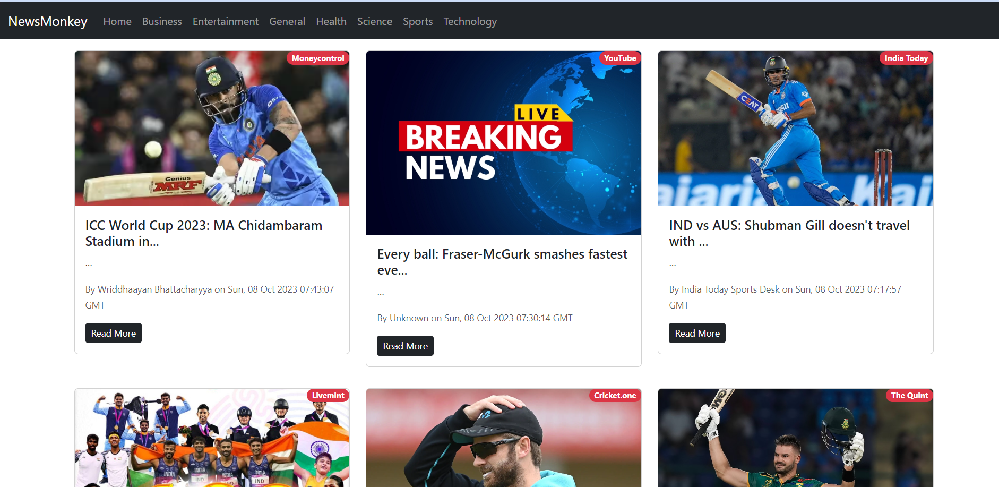

# Real-Time News Application using React

This repository contains the code for a real-time news application developed using ReactJS and Bootstrap. The application fetches real-time news updates from the News API and presents them to the user in an intuitive and engaging manner across various categories such as Sports, Entertainment, Science, and Technology.

## Features

- Real-time news updates from News API.
- News categorized into Sports, Entertainment, Science, and Technology.
- Engaging user interface built with ReactJS and Bootstrap.
- Responsive design for seamless use on various devices.

## Technologies Used

- **ReactJS:** A JavaScript library for building user interfaces.
- **Bootstrap:** A popular CSS framework for building responsive and mobile-first websites.


## Screenshots

<div style="float: left;padding: 5px;margin: 5px">
  
  
  

</div>

## Getting Started

To run this application locally, follow these steps:

1. **Clone the repository:**

    ```bash
    git clone https://github.com/your-username/news-app-react.git
    ```

2. **Navigate to the project directory:**

    ```bash
    cd newsapp
    ```

3. **Install dependencies:**

    ```bash
    npm install
    ```

4. **Start the development server:**

    ```bash
    npm start
    ```

5. **Open the application in your browser:**

    [http://localhost:3000](http://localhost:3000)

## Usage

Once the application is running, you can browse real-time news updates by selecting the desired category from the navigation menu.


